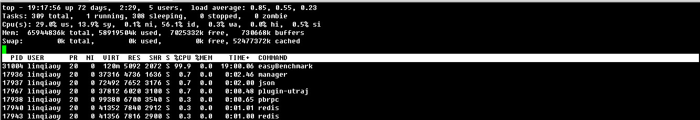
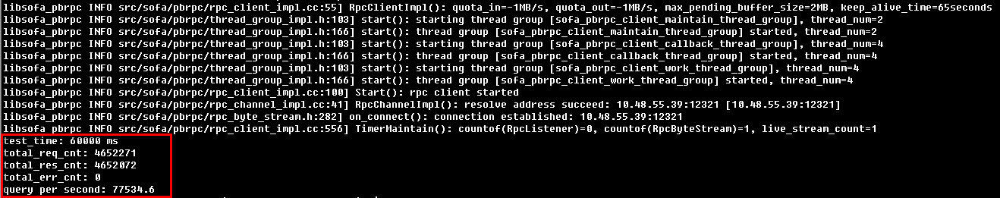

pbrpcBenchmarkTesttool
=====================

### 介绍:
基于sofa的pbrpc性能测试工具，可以使用很少的资源达到非常大的压力.

### 特性:
* 高性能，使用sofa框架C++客户端编写，压力可以达到80000左右.
* 单进程、多线程模式，可以充分利用CPU多核资源.不需要起多个进程即可达到80000 QPS，这是开源、商业、内部测试工具无法满足的.
* 使用方便，无需安装，解压即可使用，提供丰富的命令行接口.
* 支持随机发送,支持QPS统计.

### 截图:    
**1.服务端资源占用:**
![image](screenshot/001server_resource.png

**2.客户端资源占用:**
     

**3.测试结果:**
  

